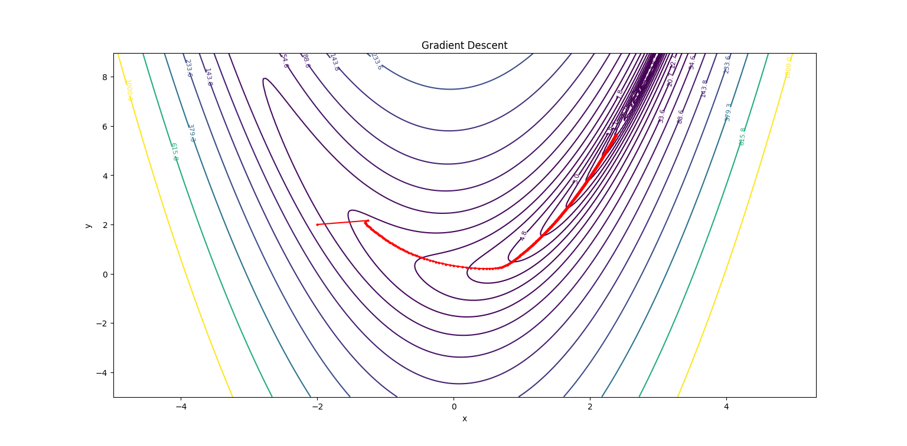
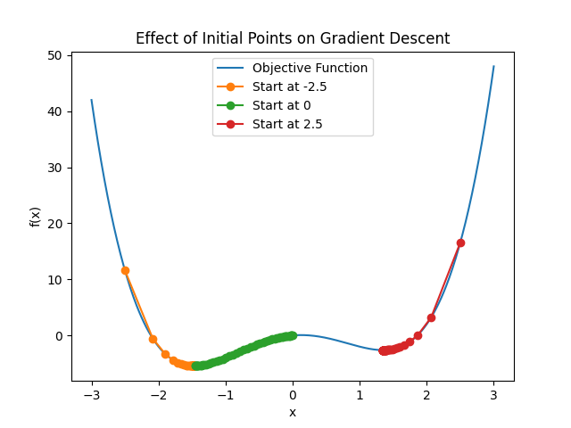
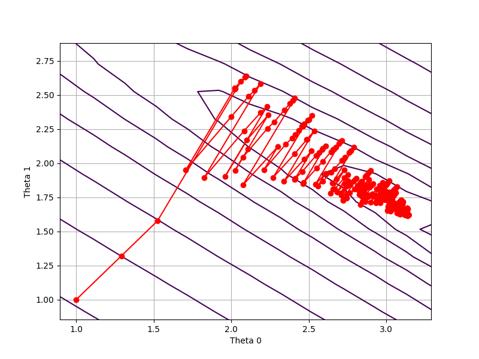
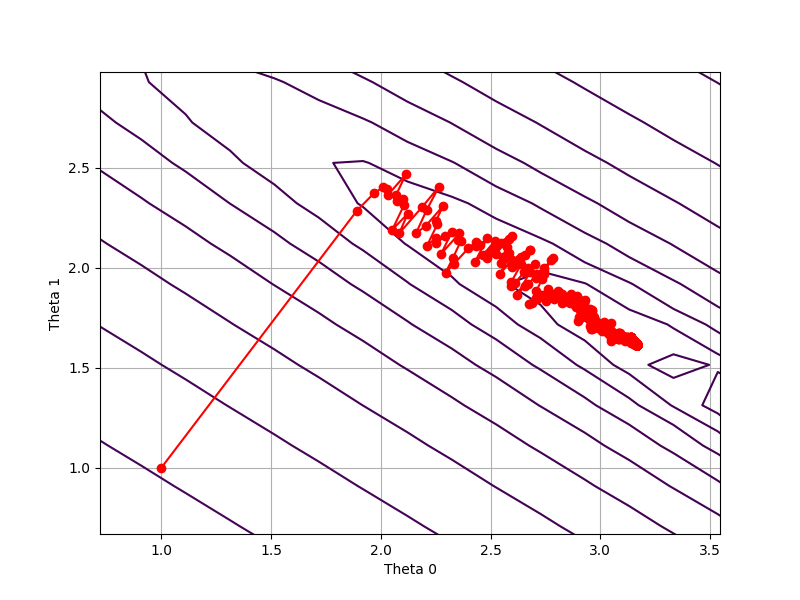

# 梯度类算法

$f(x)$为一阶可微时，才可使用梯度类算法

## 梯度下降法Gradient Descent

简言之：即算法在迭代过程中，按照当前位置的梯度方向进行搜索，逐步靠近最优值

迭代公式：

​	$X^{t+1}=X^t-\alpha_t \nabla f(X^t) $

​	$\alpha_t叫做步长或者学习率，可以用一维线搜索法确定，也可以固定步长，亦可以逐渐缩小步长。\nabla f(X^t)为f(X)在X^t处的梯度$

代码：

```python
import numpy as np
import matplotlib.pyplot as plt

# 定义f函数
def f(x, y):
    a = 3
    b = 4
    return (a - x)**2 + b * (y - x**2)**2

# 计算f函数的梯度
def f_gradient(x, y):
    a = 3
    b = 4
    dx = -2 * (a - x) - 4 * b * x * (y - x**2)
    dy = 2 * b * (y - x**2)
    return dx, dy

# 梯度下降法
def gradient_descent(initial_x, initial_y, learning_rate, epochs):
    x = initial_x
    y = initial_y
    path = [(x, y)]

    for i in range(epochs):
        grad_x, grad_y = f_gradient(x, y)
        x -= learning_rate * grad_x
        y -= learning_rate * grad_y
        path.append((x, y))

    return path

# 设置初始参数
initial_x = -2
initial_y = 2
learning_rate = 0.01
epochs = 1000

# 执行梯度下降
path = gradient_descent(initial_x, initial_y, learning_rate, epochs)

# 绘制函数的等高线图
x = np.linspace(-5, 9, 400)
y = np.linspace(-5, 9, 400)
X, Y = np.meshgrid(x, y)
Z = f(X, Y)

# 绘制梯度下降路径
path_x, path_y = zip(*path)
plt.figure(figsize=(20, 20))
contour=plt.contour(X, Y, Z, levels=np.logspace(-1, 3, 20), cmap='viridis')
# 添加等高线标签
plt.clabel(contour, inline=True, fontsize=8)
plt.plot(path_x, path_y, color='red', marker='o', markersize=2)
plt.title("Gradient Descent")
plt.xlabel("x")
plt.ylabel("y")
plt.show()

```



在使用梯度下降时，有两大问题：

1. 在使用梯度下降法时，若优化函数非凸，常常会陷入到局部极小值中（不停围绕局部极小值点震荡）

   

2. 每次都要计算全部的梯度，计算代价大

根据这两大问题，分别发展出了

1. **动量梯度下降（Momentum Gradient Descent），Nesterov 加速梯度（Nesterov Accelerated Gradient, NAG）**
2. **随机梯度下降（Stochastic Gradient Descent, SGD）**

### 敛散性分析


## 随机梯度类

为什么梯度的计算消耗资源很多？

$以线性规划y=kx+b为例，确定参数k，b，在实际求解过程中，x和y是由已给的数据集确定的，$

$也就是说用来求解目标函数是关于k和b的，使用均方误差,Loss=\frac{1}{n}\sum (y_i-\hat{y_i})^2=\frac{1}{n}\sum (y_i-kx_i-b)^2$

$\displaystyle 此时，\frac{\partial Loss}{\partial k}=\frac{-2x_i}{n}\sum_{i=1}^n(y_i-kx_i-b)=\frac{-2x_i}{n}\sum_{i=1}^n(y_i-\hat{y_i})$

当n非常大时，计算量是非常大的。

针对梯度下降法中，计算全部梯度的计算代价很大，故随机选择计算其中一部分来计算梯度，代替全部的梯度。

根据选择的数量大小

1. 随机梯度下降 (Stochastic Gradient Descent, SGD)，选择一个
2. 小批量梯度下降 (Mini-batch Gradient Descent)，选择几个

### SGD

梯度下降法的迭代公式为：

​			$X^{t+1}=X^t-\alpha_t \nabla f(X^t) $

但在绝大多数情况下，$\nabla f(X^t)$的表达式无法化简，要计算梯度必须计算出$\nabla f_i(X^t),i=1,2,...,n$，然后相加取平均

​			$\nabla f(X^t)=\frac{1}{n}\sum \nabla f_i(X^t)$

然而在机器学习中，采集到的样本量是巨大的，因此计算 $\nabla f(X^t)$ 需要非常大的计算量.

随机梯度下降，是每次从$\nabla f_i(X^t),i=1,2,...n$中随机选择一个$\nabla f_{\beta_t}(X^t),其中\beta _t是从{1，2，...,n}中随机抽取的一个样本$来近似。即

​			$X^{t+1}=X^t-\alpha_t \nabla f_{\beta_t}(X^t) $

但是单个样本对信息的描述程度并不是很好，所以一般在使用时都是随机选取一定数量的样本计算梯度，即小批量梯度下降法

```python
import numpy as np
import matplotlib.pyplot as plt


def stochastic_gradient_descent(X, y, theta, learning_rate=0.01, epochs=100):
  
    m = len(y)
    path = [theta.copy()]

    # for epoch in range(epochs):
    for i in range(epochs):

        if i%10==0:
            learning_rate=learning_rate/1.1
        # 选择一个随机索引
        rand_index = np.random.randint(0, m)
        # 获取相应的数据点
        xi = X[rand_index:rand_index + 1]
        yi = y[rand_index:rand_index + 1]
        # 计算预测值
        prediction = np.dot(xi, theta)
        # 计算误差
        error = prediction - yi
        # 计算梯度
        gradient = np.dot(xi.T, error)
        # 更新参数
        theta = theta - learning_rate * gradient
        # 保存当前的theta值
        path.append(theta.copy())


    return theta, path


def plot_contour_path(X, y, path):

    path = np.array(path)
    theta0_vals = np.linspace(-10, 10, 100)
    theta1_vals = np.linspace(-10, 10, 100)
    J_vals = np.zeros((len(theta0_vals), len(theta1_vals)))

    for i in range(len(theta0_vals)):
        for j in range(len(theta1_vals)):
            t = np.array([theta0_vals[i], theta1_vals[j]])
            J_vals[i, j] = (1 / (2 * len(y))) * np.sum((np.dot(X, t) - y) ** 2)

    J_vals = J_vals.T

    plt.figure(figsize=(8, 6))
    plt.contour(theta0_vals, theta1_vals, J_vals, levels=np.logspace(-2, 3, 20), cmap='viridis')
    plt.plot(path[:, 0], path[:, 1], marker='o', color='r')
    plt.xlabel('Theta 0')
    plt.ylabel('Theta 1')
    plt.grid()
    plt.show()


# 示例用法
if __name__ == "__main__":
    # 示例数据 (X: 特征矩阵, y: 目标向量)
    X = np.array([[1, 1.1], [1.5, 2], [2, 2.5], [2, 3.8]])
    y = np.array([5.3, 8.6, 10.4, 12])
    # 初始参数 (theta)
    theta = np.array([1,1])
    # 学习率和迭代次数
    learning_rate = 0.1
    epochs = 10000

    # 运行SGD
    theta, path = stochastic_gradient_descent(X, y, theta, learning_rate, epochs)
    print(f"优化后的参数: {theta}")

    # 绘制代价函数的等高线和theta值的路径
    plot_contour_path(X, y, path)

    print(path)
```



### 小批量梯度下降 (Mini-batch Gradient Descent)

对于随机梯度下降法来说，计算单样本的 梯度，并不能完全利用硬件资源，小批量梯度下降可以并行计算几个梯度，这样既充分利用了硬件资源，又降低了方差。

迭代

​	$\displaystyle X^{t+1}=X^t-\frac{\alpha_t}{|\Omega_t|} \sum_{i\in \Omega_t}\nabla f_i(X^t) $

$其中\Omega_t是从{1，2，3，...，n}中随机选择的一个样本集合$


```python
import numpy as np
import matplotlib.pyplot as plt


def stochastic_gradient_descent(X, y, batch,theta, learning_rate=0.01, epochs=100,):

    m = len(y)
    path = [theta.copy()]

    # for epoch in range(epochs):
    for i in range(epochs):

        if i%10==0:
            learning_rate=learning_rate/1.1
        # 选择一个随机索引
        rand_index = np.random.randint(0, m,batch)
        gradient=0
        for j in rand_index:
            # 获取相应的数据点
            xi = X[j:j + 1]
            yi = y[j:j + 1]
            # 计算预测值
            prediction = np.dot(xi, theta)
            # 计算误差
            error = prediction - yi
            # 计算梯度
            gradient += np.dot(xi.T, error)
            # 更新参数
        theta = theta - learning_rate * gradient/batch
        # 保存当前的theta值
        path.append(theta.copy())


    return theta, path


def plot_contour_path(X, y, path):

    path = np.array(path)
    theta0_vals = np.linspace(-10, 10, 100)
    theta1_vals = np.linspace(-10, 10, 100)
    J_vals = np.zeros((len(theta0_vals), len(theta1_vals)))

    for i in range(len(theta0_vals)):
        for j in range(len(theta1_vals)):
            t = np.array([theta0_vals[i], theta1_vals[j]])
            J_vals[i, j] = (1 / (2 * len(y))) * np.sum((np.dot(X, t) - y) ** 2)

    J_vals = J_vals.T

    plt.figure(figsize=(8, 6))
    plt.contour(theta0_vals, theta1_vals, J_vals, levels=np.logspace(-2, 3, 20), cmap='viridis')
    plt.plot(path[:, 0], path[:, 1], marker='o', color='r')
    plt.xlabel('Theta 0')
    plt.ylabel('Theta 1')
    plt.grid()
    plt.show()


# 示例用法
if __name__ == "__main__":
    # 示例数据 (X: 特征矩阵, y: 目标向量)
    X = np.array([[1, 1.1], [1.5, 2], [2, 2.5], [2, 3.8]])
    y = np.array([5.3, 8.6, 10.4, 12])
    # 初始参数 (theta)
    theta = np.array([1,1])
    # 学习率和迭代次数
    learning_rate = 0.1
    epochs = 10000

    # 运行SGD
    theta, path = stochastic_gradient_descent(X, y,4, theta, learning_rate, epochs)
    print(f"优化后的参数: {theta}")

    # 绘制代价函数的等高线和theta值的路径
    plot_contour_path(X, y, path)

    print(path)
```



## 动量梯度下降（Momentum Gradient Descent）

在标准梯度下降的基础上，引入动量项，加速收敛并减少震荡。

迭代公式

​	$\theta_t=\beta\theta_{t-1}+(1-\beta)\nabla f(X^t)，也有写成\theta_t=\beta\theta_{t-1}+\nabla f(X^t)$

​	$X^{t+1}=X^t-\alpha_t \theta_t $

这里的$\nabla f(X^t)可以是\nabla f_{\beta_t}(X^t)，\frac{1}{|\Omega_t|} \sum_{i\in \Omega_t}\nabla f_i(X^t)$

本质上，其实就是梯度的平滑

$\theta_t=(1-\beta)[\nabla f(X^t)+\beta \nabla f(X^{t-1})+\beta^2 \nabla f(X^{t-2}).....]$

$\beta的常见取值[0.5,0.9,0.95,0.99]$

动量梯度下降法，保留了之前的梯度方向的影响，使得可以靠“惯性”冲出局部极小值


## Nesterov 加速梯度（Nesterov Accelerated Gradient, NAG）

在动量梯度的基础上，提前计算参数的更新方向，提高收敛速度和稳定性

迭代公式

​	$\theta_t=\beta\theta_{t-1}+\alpha_t\nabla f(X^t-\beta \theta_{t-1})$

​	$X^{t+1}=X^t- \theta_t $

## Adam


本质上是带动量项的 RMSProp

计算梯度的一阶动量（即梯度的指数加权平均）和二阶动量（即梯度平方的指数加权平均）来调整每个参数的学习率

$\theta_t=\beta_1\theta_{t-1}+(1-\beta_1)\nabla f(X^t)$

$\gamma_t=\beta_2\gamma_{t-1}+(1-\beta_2)\nabla^2f(X^t)$

上述两式实际是梯度的平滑，

$\theta_t=(1-\beta_1)[\nabla f(X^t)+\beta_1 \nabla f(X^{t-1})+\beta^2_1 \nabla f(X^{t-2}).....]$

$\gamma_t=(1-\beta_2)[\nabla^2 f(X^t)+\beta_2 \nabla^2 f(X^{t-1})+\beta^2_2 \nabla^2 f(X^{t-2}).....]$

$然而，只有当t比较大时，\theta_t=(1-\beta_1)\frac{\nabla f(X^t)}{1-\beta_1}=\nabla f(X^t)，\gamma_t=\nabla^2f(X^t)$

所以需要修正一下

$\hat{\theta_t}=\frac{\theta_t}{1-\beta_1^t},\hat{\gamma_t}=\frac{\gamma_t}{1-\beta_2} $

$X^{t+1}=X^t-\frac{\alpha}{\sqrt{\hat{\gamma_t}+\varepsilon 1_n}}\odot \hat{\theta_t},\alpha为步长， \varepsilon 1_n防止除0$

所以为什么？？？这样修正？？为什么这样迭代？


# 次梯度算法

若函数$f(x)$为凸函数，但是不一定可微，

## 次梯度

在其定义域内，我们定义f(x)的次梯度（**subgradient**）：

​						$\partial f(x)=\{g|f(y)\geq f(x)+g^T(y-x),\forall y \in dom f\}$

**实际上，次梯度是不可导点所有支撑超平面的梯度集合**

## 算法结构

类似于梯度法的构造，
$$
x^{k+}=x^k-\alpha_kg^k,g^k\in \partial f(x)
$$
步长选择

1. $\alpha_k$取为固定$\alpha$
2. 消失步长$\displaystyle \alpha_k \rightarrow 0,且\sum_{i=1}^{\infty}=+\infty$,为什么要趋于正无穷？
3. 固定$||x^{k+1}-x^k||为常数，也就是\alpha_k|| g^k||为常数$
4. 按照一维线搜索法确定$\alpha_k $

次微分$\partial f(x)$是一个集合，在次梯度算法的构造中只要求从这个集合中选出一个次梯度即可


## 收敛性分析

$目标函数f(x)满足,f为凸函数且利普西茨连续，至少存在一个有限的极小值点x^*,且f(x^*)>-\infty, $

1. 取步长为固定t时，
   $$
   \hat{f}^k-f^*\leq\frac{||x^0-x^*||^2}{2kt}+\frac{G^2t}{2}
   $$
   

2. 取步长使得$||x^{k+1}-x^k||为常数$
   $$
   \hat{f}^k-f^*\leq \frac{G||x^0-x^*||^2}{2ks}+\frac{Gs}{2}
   $$
   

3. 取 消失步长时
   $$
   \hat{f}^k-f^*\leq \frac{||x^0-x^*||^2+G^2\sum_{i=1}^k\alpha_i^2}{2\sum_{i=1}^k\alpha_i}
   $$
   


# 牛顿类算法(**Newton Method**)

​	梯度类算法依赖于函数值和一阶梯度的信息，而当某些特定的函数足够光滑时，那么其二阶梯度的信息在梯度法中就被浪费掉。牛顿法就是利用二阶梯度的信息来构造迭代的一种算法。（利用的信息变多，牛顿法的实际表现一般优于梯度法，但是对函数的要求也变高）

## 经典牛顿法

### 算法

$$
根据泰勒公式 \\f(x^k+d^k)=f(x^k)+\nabla f(x^k)^T d^k+\frac{1}{2} (d^k)^T \nabla^2f(x^k)d^k+O(||d^k||^2)\\
如果忽略掉高阶无穷小项，那么可以看成使d^k的函数\\
则对d^k的导函数:\nabla f(x^k)+\nabla^2f(x^k)d^k=0\\
故d^K=-\nabla^2f(x^k)^{-1}\nabla f(x^k)\\
故，对x的迭代为：X^{k+1}=x^k+d^k
$$

在这里，步长 $\alpha^k$恒为 1，即可以不额外考虑步长的选取．也称步长为 1 的牛顿法为经典牛顿法．

### 收敛性分析

经典牛顿法有很好的局部收敛性

定理1：

​	假设目标函数f为二阶连续可微的函数，且Hessian矩阵在最优点$x^*$的一个邻域内$N_{\eta}(x^*)$内利普西茨连续，即存在常数L>0，使得

​				$||\nabla^2f(x)-\nabla^2f(y)|| \leq L||x-y||, \forall x,y\in N_{\eta}(x^*)$ 

如果目标函数$f(x)在x^*处满足，\nabla f(x^*)=0,\nabla^2 f(x^*) \succ 0(Hessian阵正定)$

则：

1. $如果初始点离 x^*足够近，则牛顿法产生的迭代点列 \{x^k\}收敛到x^*$
2. $\{x^k\}收敛到x^*的速度是Q-二次的$
3. $\{||\nabla f(x^k)||\}Q-二次收敛到0$

证明1：

​							$x^{k+1}-x^*=x^k-d^k-x^*\\=x^k-\nabla^2f(x^k)^{-1}\nabla f(x^k)-x^*\\=\nabla^2f(x^{k})^{-1}\{\nabla^2f(x^k)(x^k-x^*)-\nabla f(x^k)\}$

因为$\nabla f(x^*)=0$

$\nabla^2f(x^{k})^{-1}\{\nabla^2f(x^k)(x^k-x^*)-\nabla f(x^k)\}=\nabla^2f(x^{k})^{-1}\{\nabla^2f(x^k)(x^k-x^*)-(\nabla f(x^k)-\nabla f(x^*))\}$

而

$\displaystyle \nabla f(x^k)-\nabla f(x^*)=\int_0^1 \nabla^2 f(x^k+t(x^*-x^k))(x^k-x^*)dt$

所以：

​						$||\nabla^2f(x^k)(x^k-x^*)-(\nabla f(x^k)-\nabla f(x^*))||\\=||\nabla^2f(x^k)(x^k-x^*)-\int_0^1 \nabla^2 f(x^k+t(x^*-x^k))(x^k-x^*)dt||\\=||\int_0^1[\nabla^2f(x^k+t(x^*-x^k))-\nabla^2f(x^k)](x^k-x^*)dt||\\ \leq \int_0^1[||\nabla^2f(x^k+t(x^*-x^k))-\nabla^2f(x^k)]||||x^k-x^*||dt\\ \leq||x^k-x^*||^2 \int_0^1Ltdt\\=\frac{L}{2}||x^k-x^*||^2$

因为$\nabla^2f(x^*)是非奇异的，故||\nabla^2f(x^k)^{-1}||\leq 2||\nabla^2f(x^k)^{-1}||$

​						$||x^k-x^*||=||\nabla^2f(x^{k})^{-1}\{\nabla^2f(x^k)(x^k-x^*)-\nabla f(x^k)\} ||\\ \leq ||\nabla^2f(x^{k})^{-1}||||\nabla^2f(x^k)(x^k-x^*)-\nabla f(x^k)|| \\\leq L||\nabla^2f(x^{k})^{-1}||||x^k-x^*||^2$

## 修正牛顿法（带线搜索）

经典牛顿法的缺陷：

1. 每一步迭代都要解一个n维线性方程组，高维时计算量很大，而且Hessian矩阵既难算又难存储
2. 需要要求Hessian矩阵正定，不正定时，$d^k$不一定是合适的下降方向。
3. 步长恒为1，不稳定

改进：

1. 对Hessian矩阵修正，使其变成正定矩阵
2. 引入线搜索，改善稳定性


### 算法过程

给定初始点$x_0$

for k=1,2,...,do:

​			确定矩阵$E^k$使得$B^k \overset{def}{=}\nabla^2f(x^k)+E^k$正定且条件数较小

​			求解修正后的方程$B^kd^k=-\nabla f(x^k)$

​			使用一维线搜索法确定步长$\alpha_k$

​			更新$x^{k+1}=x^k+\alpha_kd^k$

end 

对于$E^k$的确定，最直接的方法是取$E^k=n_kI$,即取单位阵的整数倍，当$n_k$足够大时，可以保证$B^k$正定

另一种方法是通过修正Cholesky分解来解$\nabla f(x^k)+\nabla^2f(x^k)d^k=0$


# 拟牛顿类算法(**Quasi Newton method**)

用牛顿法来计算，理论上效果是很好的，但是，对于大规模问题，不仅要求解Hessian矩阵，还要求解庞大的线性方程组，计算量非常大。因而考虑用近似的矩阵来替代Hessian矩阵

拟牛顿法不计算Hessian矩阵，而是通过构造其近似矩阵$B^k$ 或其逆的近似矩阵$H^k$

**割线方程**

​	$\nabla f(x)=\nabla f(x^{k+1})+\nabla^2f(x^{k+1})(x-x^{k+1})+O(||x-x^{k+1}||^2)$

$令x=x^k,y^k=\nabla f(x^{k+1})-\nabla f(x^k),s^k=x^{k+1}-x^k$

$y^k=\nabla^2f(x^{k+1})s^k+O(||s^k||^2)$

忽略高阶项，我们希望近似矩阵$B^{k+1}$满足

$y^k=B^{k+1}s^k$

## SR1更新

$B^{k+1}=B^k+auu^T,其中u\in R^N,a \in R,待定$

根据割线方程

​					$B^{k+1}s^k=(B^k+auu^T)s^k=y^k$

注意到$au^Ts^k为标量$

​					$(au^Ts^k)u=y^k-B^ks^k$

故$u与y^k-B^ks^k的方向是一样的，不妨令u=y^k-B^ks^k$，带入原方程

​					$(a(y^k-B^ks^k)^Ts^k)(y^k-B^ks^k)=y^k-B^ks^k$

$(y^k-B^ks^k)^Ts^k$不为0时，可以得到

​					$a=\frac{1}{(y^k-B^ks^k)^Ts^k}$

所以，更新公式为

​					$B^{k+1}=B^k+\frac{(y^k-B^ks^k)(y^k-B^ks^k)^T}{(y^k-B^ks^k)^Ts^k}$

缺陷：不能保证在迭代过程中，$B^{k+1}$一直正定

## BFGS更新


$B^{k+1}=B^k+auu^T+b\nu \nu^T,其中u,\nu\in R^N,a,b \in R,待定$

根据割线方程
$$
B^{k+1}s^k=(B^k+auu^T+b\nu \nu^T)s^k=y^k\\
(au^Ts^k)u+(b\nu^Ts^k)\nu=y^k-B^ks^k\\
$$
一种非常直观的取法（当然有很多种取法）


$$
u=y^k,au^Ts^k=1\\
\nu=B^ks^k,b\nu^Ts^k=-1\\
$$
因此得到更新方式


$$
B^{K+}=B^k+\frac{y^k(y^k)^T}{(s^K)^Ty^k}-\frac{B^ks^k(B^ks^k)^T}{(s^k)^TB^ks^k}
$$


