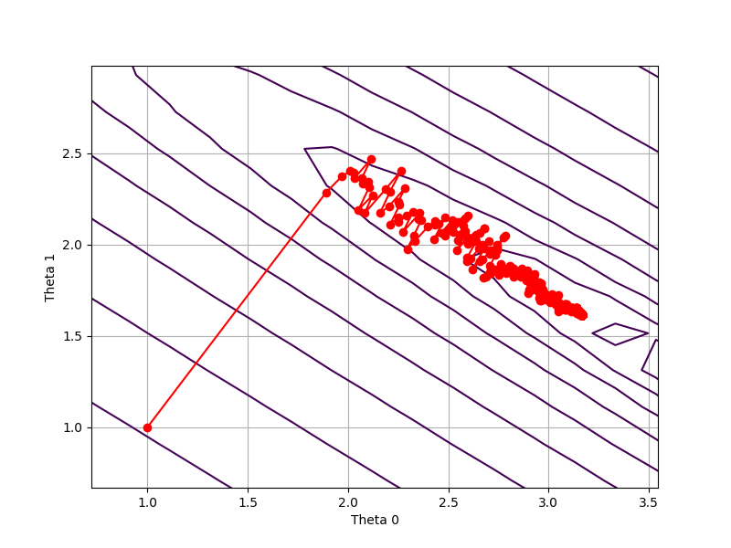

# 梯度下降法Gradient Descent

简言之：即算法在迭代过程中，按照当前位置的梯度方向进行搜索，逐步靠近最优值

迭代公式：

​	$X^{t+1}=X^t-\alpha_t \nabla f(X^t) $

​	$\alpha_t叫做步长或者学习率，可以用一维线搜索法确定，也可以固定步长，\nabla f(X^t)为f(X)在X^t处的梯度$

代码：

```python
import numpy as np
import matplotlib.pyplot as plt

# 定义f函数
def f(x, y):
    a = 3
    b = 4
    return (a - x)**2 + b * (y - x**2)**2

# 计算f函数的梯度
def f_gradient(x, y):
    a = 3
    b = 4
    dx = -2 * (a - x) - 4 * b * x * (y - x**2)
    dy = 2 * b * (y - x**2)
    return dx, dy

# 梯度下降法
def gradient_descent(initial_x, initial_y, learning_rate, epochs):
    x = initial_x
    y = initial_y
    path = [(x, y)]

    for i in range(epochs):
        grad_x, grad_y = f_gradient(x, y)
        x -= learning_rate * grad_x
        y -= learning_rate * grad_y
        path.append((x, y))

    return path

# 设置初始参数
initial_x = -2
initial_y = 2
learning_rate = 0.01
epochs = 1000

# 执行梯度下降
path = gradient_descent(initial_x, initial_y, learning_rate, epochs)

# 绘制函数的等高线图
x = np.linspace(-5, 9, 400)
y = np.linspace(-5, 9, 400)
X, Y = np.meshgrid(x, y)
Z = f(X, Y)

# 绘制梯度下降路径
path_x, path_y = zip(*path)
plt.figure(figsize=(20, 20))
contour=plt.contour(X, Y, Z, levels=np.logspace(-1, 3, 20), cmap='viridis')
# 添加等高线标签
plt.clabel(contour, inline=True, fontsize=8)
plt.plot(path_x, path_y, color='red', marker='o', markersize=2)
plt.title("Gradient Descent")
plt.xlabel("x")
plt.ylabel("y")
plt.show()

```


在使用梯度下降时，有两大问题：

1. 在使用梯度下降法时，若优化函数非凸，常常会陷入到局部极小值中（不停围绕局部极小值点震荡）

   

2. 每次都要计算全部的梯度，计算代价大

根据这两大问题，分别发展出了

1. **动量梯度下降（Momentum Gradient Descent），Nesterov 加速梯度（Nesterov Accelerated Gradient, NAG）**
2. **随机梯度下降（Stochastic Gradient Descent, SGD）**

# 随机梯度类

针对梯度下降法中，计算全部梯度的计算代价很大，故随机选择计算其中一部分来计算梯度，代替全部的梯度。

根据选择的数量大小

1. 随机梯度下降 (Stochastic Gradient Descent, SGD)，选择一个
2. 小批量梯度下降 (Mini-batch Gradient Descent)，选择几个

## SGD

梯度下降法的迭代公式为：

​			$X^{t+1}=X^t-\alpha_t \nabla f(X^t) $

但在绝大多数情况下，$\nabla f(X^t)$的表达式无法化简，要计算梯度必须计算出$\nabla f_i(X^t),i=1,2,...,n$，然后相加取平均

​			$\nabla f(X^t)=\frac{1}{n}\sum \nabla f_i(X^t)$

然而在机器学习中，采集到的样本量是巨大的，因此计算 $\nabla f(X^t)$ 需要非常大的计算量.

随机梯度下降，是每次从$\nabla f_i(X^t),i=1,2,...n$中随机选择一个$\nabla f_{\beta_t}(X^t),其中\beta _t是从{1，2，...,n}中随机抽取的一个样本$来近似。即

​			$X^{t+1}=X^t-\alpha_t \nabla f_{\beta_t}(X^t) $

但是单个样本对信息的描述程度并不是很好，所以一般在使用时都是随机选取一定数量的样本计算梯度，即小批量梯度下降法

```python
import numpy as np
import matplotlib.pyplot as plt


def stochastic_gradient_descent(X, y, theta, learning_rate=0.01, epochs=100):
  
    m = len(y)
    path = [theta.copy()]

    # for epoch in range(epochs):
    for i in range(epochs):

        if i%10==0:
            learning_rate=learning_rate/1.1
        # 选择一个随机索引
        rand_index = np.random.randint(0, m)
        # 获取相应的数据点
        xi = X[rand_index:rand_index + 1]
        yi = y[rand_index:rand_index + 1]
        # 计算预测值
        prediction = np.dot(xi, theta)
        # 计算误差
        error = prediction - yi
        # 计算梯度
        gradient = np.dot(xi.T, error)
        # 更新参数
        theta = theta - learning_rate * gradient
        # 保存当前的theta值
        path.append(theta.copy())


    return theta, path


def plot_contour_path(X, y, path):

    path = np.array(path)
    theta0_vals = np.linspace(-10, 10, 100)
    theta1_vals = np.linspace(-10, 10, 100)
    J_vals = np.zeros((len(theta0_vals), len(theta1_vals)))

    for i in range(len(theta0_vals)):
        for j in range(len(theta1_vals)):
            t = np.array([theta0_vals[i], theta1_vals[j]])
            J_vals[i, j] = (1 / (2 * len(y))) * np.sum((np.dot(X, t) - y) ** 2)

    J_vals = J_vals.T

    plt.figure(figsize=(8, 6))
    plt.contour(theta0_vals, theta1_vals, J_vals, levels=np.logspace(-2, 3, 20), cmap='viridis')
    plt.plot(path[:, 0], path[:, 1], marker='o', color='r')
    plt.xlabel('Theta 0')
    plt.ylabel('Theta 1')
    plt.grid()
    plt.show()


# 示例用法
if __name__ == "__main__":
    # 示例数据 (X: 特征矩阵, y: 目标向量)
    X = np.array([[1, 1.1], [1.5, 2], [2, 2.5], [2, 3.8]])
    y = np.array([5.3, 8.6, 10.4, 12])
    # 初始参数 (theta)
    theta = np.array([1,1])
    # 学习率和迭代次数
    learning_rate = 0.1
    epochs = 10000

    # 运行SGD
    theta, path = stochastic_gradient_descent(X, y, theta, learning_rate, epochs)
    print(f"优化后的参数: {theta}")

    # 绘制代价函数的等高线和theta值的路径
    plot_contour_path(X, y, path)

    print(path)
```


## 小批量梯度下降 (Mini-batch Gradient Descent)

对于随机梯度下降法来说，计算单样本的 梯度，并不能完全利用硬件资源，小批量梯度下降可以并行计算几个梯度，这样既充分利用了硬件资源，又降低了方差。

迭代

​	$\displaystyle X^{t+1}=X^t-\frac{\alpha_t}{|\Omega_t|} \sum_{i\in \Omega_t}\nabla f_i(X^t) $

$其中\Omega_t是从{1，2，3，...，n}中随机选择的一个样本集合$

```python
import numpy as np
import matplotlib.pyplot as plt


def stochastic_gradient_descent(X, y, batch,theta, learning_rate=0.01, epochs=100,):

    m = len(y)
    path = [theta.copy()]

    # for epoch in range(epochs):
    for i in range(epochs):

        if i%10==0:
            learning_rate=learning_rate/1.1
        # 选择一个随机索引
        rand_index = np.random.randint(0, m,batch)
        gradient=0
        for j in rand_index:
            # 获取相应的数据点
            xi = X[j:j + 1]
            yi = y[j:j + 1]
            # 计算预测值
            prediction = np.dot(xi, theta)
            # 计算误差
            error = prediction - yi
            # 计算梯度
            gradient += np.dot(xi.T, error)
            # 更新参数
        theta = theta - learning_rate * gradient/batch
        # 保存当前的theta值
        path.append(theta.copy())


    return theta, path


def plot_contour_path(X, y, path):

    path = np.array(path)
    theta0_vals = np.linspace(-10, 10, 100)
    theta1_vals = np.linspace(-10, 10, 100)
    J_vals = np.zeros((len(theta0_vals), len(theta1_vals)))

    for i in range(len(theta0_vals)):
        for j in range(len(theta1_vals)):
            t = np.array([theta0_vals[i], theta1_vals[j]])
            J_vals[i, j] = (1 / (2 * len(y))) * np.sum((np.dot(X, t) - y) ** 2)

    J_vals = J_vals.T

    plt.figure(figsize=(8, 6))
    plt.contour(theta0_vals, theta1_vals, J_vals, levels=np.logspace(-2, 3, 20), cmap='viridis')
    plt.plot(path[:, 0], path[:, 1], marker='o', color='r')
    plt.xlabel('Theta 0')
    plt.ylabel('Theta 1')
    plt.grid()
    plt.show()


# 示例用法
if __name__ == "__main__":
    # 示例数据 (X: 特征矩阵, y: 目标向量)
    X = np.array([[1, 1.1], [1.5, 2], [2, 2.5], [2, 3.8]])
    y = np.array([5.3, 8.6, 10.4, 12])
    # 初始参数 (theta)
    theta = np.array([1,1])
    # 学习率和迭代次数
    learning_rate = 0.1
    epochs = 10000

    # 运行SGD
    theta, path = stochastic_gradient_descent(X, y,4, theta, learning_rate, epochs)
    print(f"优化后的参数: {theta}")

    # 绘制代价函数的等高线和theta值的路径
    plot_contour_path(X, y, path)

    print(path)
```



# 动量梯度下降（Momentum Gradient Descent）

在标准梯度下降的基础上，引入动量项，加速收敛并减少震荡。

迭代公式

​	$\theta_t=\beta\theta_{t-1}+(1-\beta)\nabla f(X^t)，也有写成\theta_t=\beta\theta_{t-1}+\nabla f(X^t)$

​	$X^{t+1}=X^t-\alpha_t \theta_t $

这里的$\nabla f(X^t)可以是\nabla f_{\beta_t}(X^t)，\frac{1}{|\Omega_t|} \sum_{i\in \Omega_t}\nabla f_i(X^t)$

本质上，其实就是梯度的平滑

$\theta_t=(1-\beta)[\nabla f(X^t)+\beta \nabla f(X^{t-1})+\beta^2 \nabla f(X^{t-2}).....]$

$\beta的常见取值[0.5,0.9,0.95,0.99]$

动量梯度下降法，保留了之前的梯度方向的影响，使得可以靠“惯性”冲出局部极小值

# Nesterov 加速梯度（Nesterov Accelerated Gradient, NAG）

在动量梯度的基础上，提前计算参数的更新方向，提高收敛速度和稳定性

迭代公式

​	$\theta_t=\beta\theta_{t-1}+\alpha_t\nabla f(X^t-\beta \theta_{t-1})$

​	$X^{t+1}=X^t- \theta_t $

# Adam


本质上是带动量项的 RMSProp

计算梯度的一阶动量（即梯度的指数加权平均）和二阶动量（即梯度平方的指数加权平均）来调整每个参数的学习率

$\theta_t=\beta_1\theta_{t-1}+(1-\beta_1)\nabla f(X^t)$

$\gamma_t=\beta_2\gamma_{t-1}+(1-\beta_2)\nabla^2f(X^t)$

上述两式实际是梯度的平滑，

$\theta_t=(1-\beta_1)[\nabla f(X^t)+\beta_1 \nabla f(X^{t-1})+\beta^2_1 \nabla f(X^{t-2}).....]$

$\gamma_t=(1-\beta_2)[\nabla^2 f(X^t)+\beta_2 \nabla^2 f(X^{t-1})+\beta^2_2 \nabla^2 f(X^{t-2}).....]$

$然而，只有当t比较大时，\theta_t=(1-\beta_1)\frac{\nabla f(X^t)}{1-\beta_1}=\nabla f(X^t)，\gamma_t=\nabla^2f(X^t)$

所以需要修正一下

$\hat{\theta_t}=\frac{\theta_t}{1-\beta_1^t},\hat{\gamma_t}=\frac{\gamma_t}{1-\beta_2} $

$X^{t+1}=X^t-\frac{\alpha}{\sqrt{\hat{\gamma_t}+\varepsilon 1_n}}\odot \hat{\theta_t},\alpha为步长， \varepsilon 1_n防止除0$

所以为什么？？？这样修正？？为什么这样迭代？


